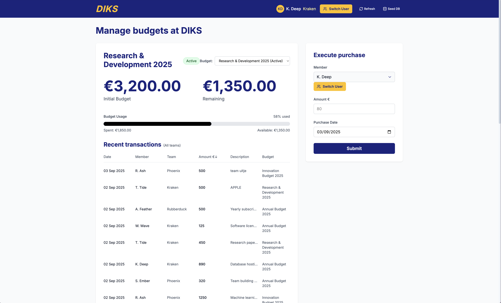

You can run locally using 'npm install' & 'npm run dev' or use this url to check the Vercel deployed version: https://diks-budgetter.vercel.app/

The yellow Switch User, refresh and Seed DB are only for development, they won't be visible in a live version.

- You can switch between users by clicking Switch User, you can see the teams below the users email.
- each team has their own budget(s) to spend
- each user can see the Recent transactions of their own team only
- an admin user (in yelllow admin with a crown in front) can see EVERY recent transaction of each team and also had a budget history down the page with an overview of each budget per team, what is left and how much is spent.
- a user can execute a purchase by clicking on submit, entering the amount and the description what the transaction is for. 
- the system algorithm will then choose the optimal budget (using function getOptimalBudget in lib/prisma.ts) to spend it from. Right now this is done by checking which budget is almost fully spend and which budget will expire the earliest. This way a team budget won't go to waste.